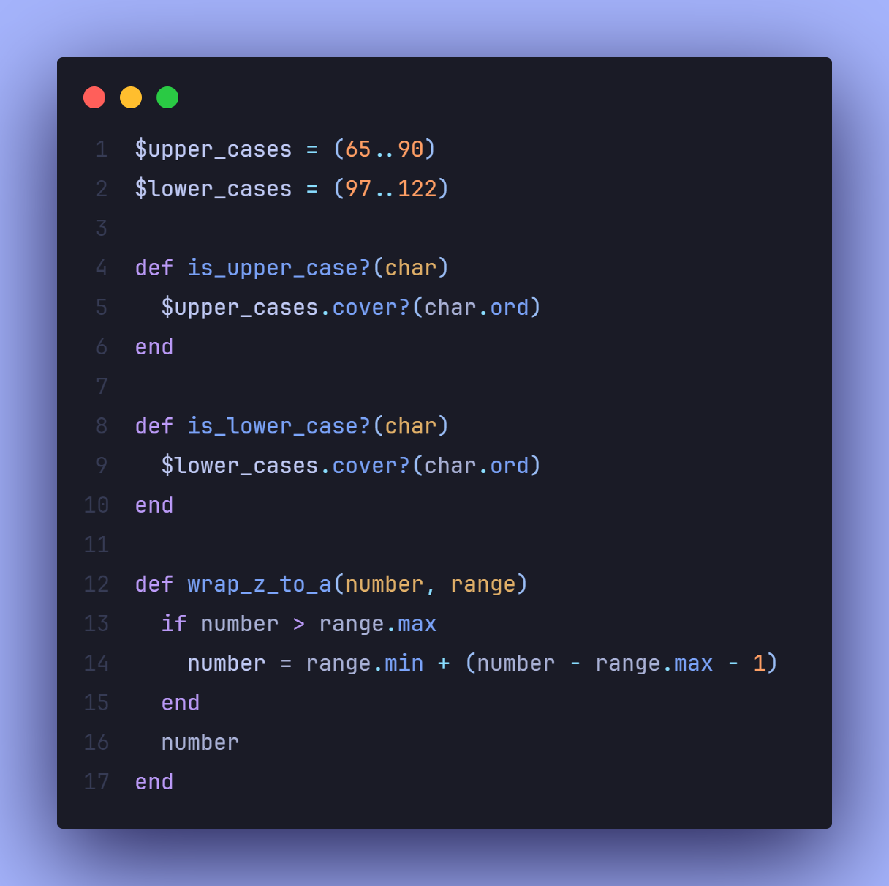
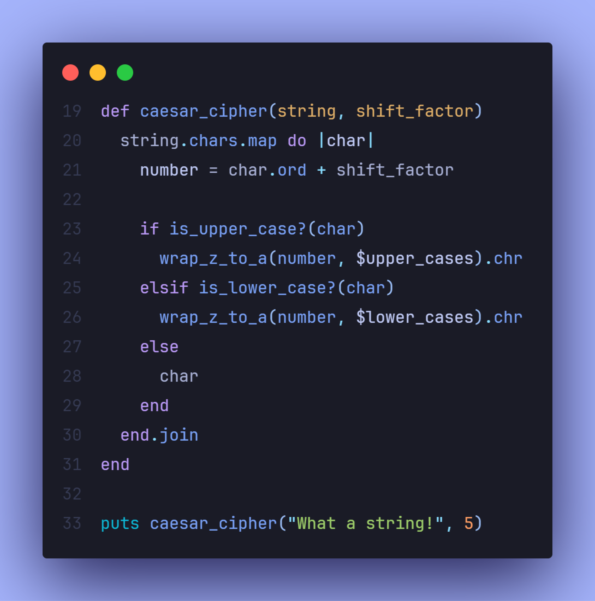

# 

 
 

The Caesar Cipher is a simple and classic encryption technique where each letter in a string is shifted by a fixed number of positions in the alphabet. This project takes an input string and a shift factor, then outputs the encrypted message while maintaining spaces and punctuation.

 Screenshots

  
    

    
&nbsp;
    

## 📝 Project Objective

The objective of this project is to reinforce the basics of Ruby by manipulating strings, arrays, and flow control structures. It helps build a deeper understanding of character encoding, loops, and conditionals through the implementation of an encryption technique.

## 🔧 Features

- Encrypts a given string using the Caesar Cipher method.

- Maintains the case of the original characters (uppercase and lowercase letters remain unchanged).

- Punctuation and spaces are preserved in the output.

- Wraps around the alphabet (e.g., 'z' becomes 'a' when shifted forward).

## 📖 Learnings

- **String manipulation**: Handling character conversions between letters and numbers using ASCII codes.

- **Control flow**: Utilizing conditionals and loops to implement the wrapping of letters.

- **Modular arithmetic**: Applying the modulus operator to ensure correct letter shifts within the bounds of the alphabet.

- **Case preservation**: Implementing logic to distinguish between uppercase and lowercase characters.

## 💻 Technologies Used

- **Ruby** for implementing the Caesar Cipher algorithm and managing string manipulations.

## 💡 Acknowledgments

- **The Odin Project**: For providing the project outline and guidance.
