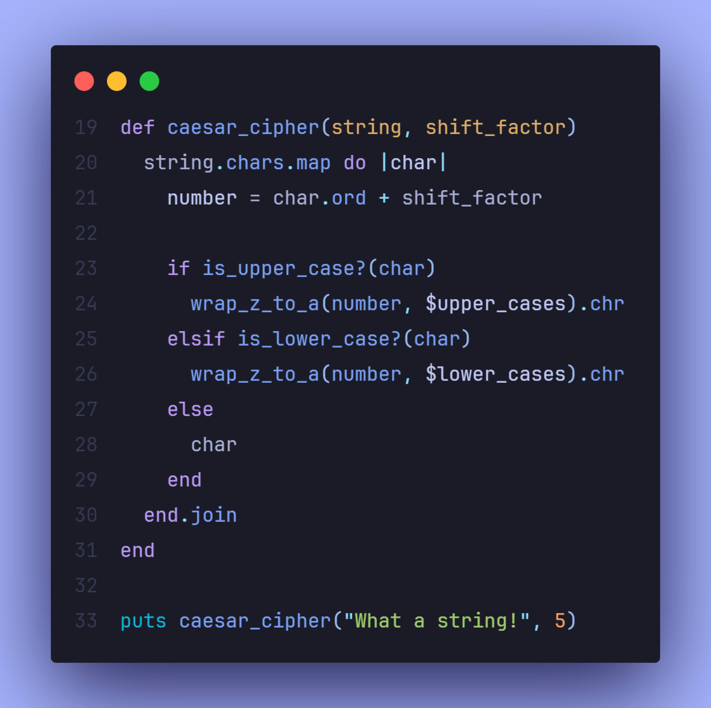

# 

 
 

This project is part of The Odin Project's Ruby course. In this assignment, I implemented a Caesar cipher, a simple yet widely known encryption technique that replaces each letter in the plaintext with a letter a fixed number of positions down the alphabet. The challenge reinforced my understanding of string manipulation, conditionals, and flow control in Ruby.

 Screenshots

  
    

    
&nbsp;
    

## 📝 Project Objective

The goal was to create a method that takes a string and a shift factor, then outputs the modified string according to the Caesar cipher rules. This project helped solidify my knowledge of string handling and character encoding in Ruby.

## 🔧 Features

- Accepts a string input and a shift factor.

- Handles both uppercase and lowercase letters while maintaining their case.

- Wraps around the alphabet, so letters shifted past 'z' return to 'a'.

- Ignores non-alphabetic characters, keeping them unchanged.

## 📖 Learnings

- **String Manipulation**: Improved my ability to manipulate and iterate through strings in Ruby.

- **Conditionals**: Enhanced my understanding of conditionals to determine character cases and handle logic.

- **Character Encoding**: Gained experience with ASCII values and how to convert characters based on their ordinal values.

- **Algorithm Development**: Practiced creating a simple encryption algorithm while focusing on code efficiency and clarity.

## 💻 Technologies Used

- **Ruby** for implementing the functionality of the Caesar cipher.

## 💡 Acknowledgments

- **The Odin Project**: For providing the project outline and guidance.
